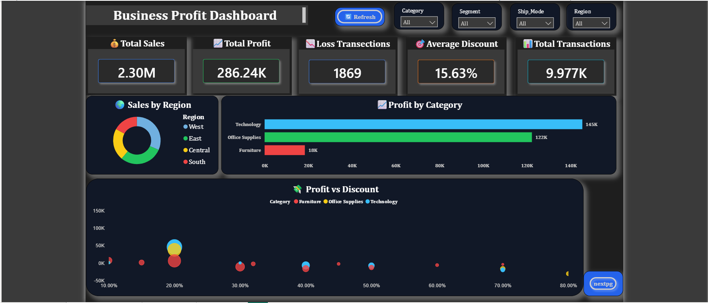
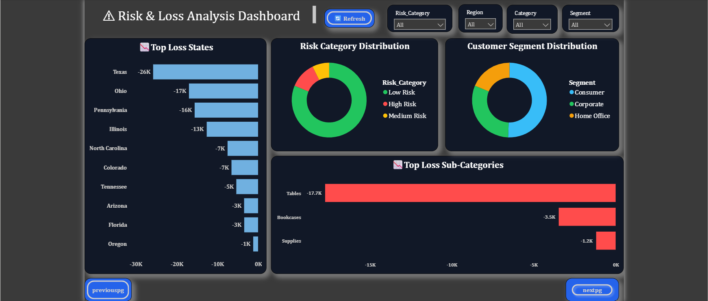

# Business Profit Analyzer

## Overview
Business Profit Analyzer is a Data Analytics project developed using Python, SQL, Power BI, and Streamlit. The project focuses on identifying profit leakage, analyzing sales performance, and generating actionable business insights.

## Technologies Used
- Python
- SQL
- Power BI
- Streamlit
- Pandas
- NumPy

## Features
- Sales Performance Analysis
- Profit Leakage Detection
- KPI Monitoring Dashboard
- Regional and Category-wise Analysis
- Interactive Business Reporting

## Project Files
- `app.py` – Streamlit Dashboard
- `analysis.ipynb` – Data Analysis Notebook
- `business profit.sql` – SQL Queries
- `business profit analyzer.pbix` – Power BI Dashboard
- `Superstore.csv` – Dataset

## Key Insights
- Identified loss-making products and categories
- Analyzed profitability across regions
- Monitored KPIs using Power BI dashboards
- Generated business insights for decision-making
- 
## Dashboard Screenshots

### Dashboard Overview

### Risk and Loss Analysis

### Ml Analysis

